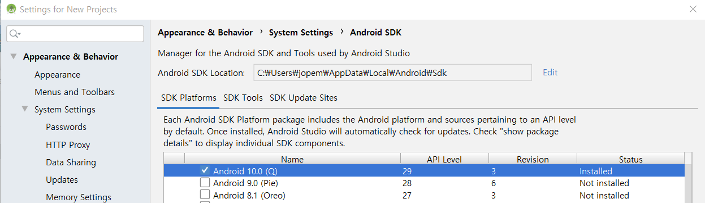

### BookingServiceForSelfEmployed

### Development Environment

> react 16.9.0
>
> react-native 0.61.2
>
> react-native-gesture-handler 1.4.1
>
> react-native-paper 2.16.0
>
> react-native-vector-icons 6.6.0
>
> react-navigation-stack 1.9.4
>
> react-native-splash-screen

### How to use

npm i로 package.json의 node_modules를 설치.

npm i react-native-cli -g로 react-native-cli를 전역에 설치.

AVD Manager로 시뮬레이터를 구동한 뒤 react-native run-android로 실행

### Issue 

* Script 'C:\BookingService\node_modules\@react-native-community\cli-platform-android\native_modules.gradle' line: 169

=> npm i @react-native-community/cli-platform-android 실행해 cli-platform-android 설치

* SDK location not found. Define location with an ANDROID_SDK_ROOT environment variable or by setting the sdk.dir path in your project's local properties file at..

=> 환경변수 ANDROID_HOME을 정의하지 않아서 생기는 문제

아래처럼 Android Studio > Tools > SDK Manager에서 SDK 설치 경로를 확인할 수 있다.

### Screen shot
